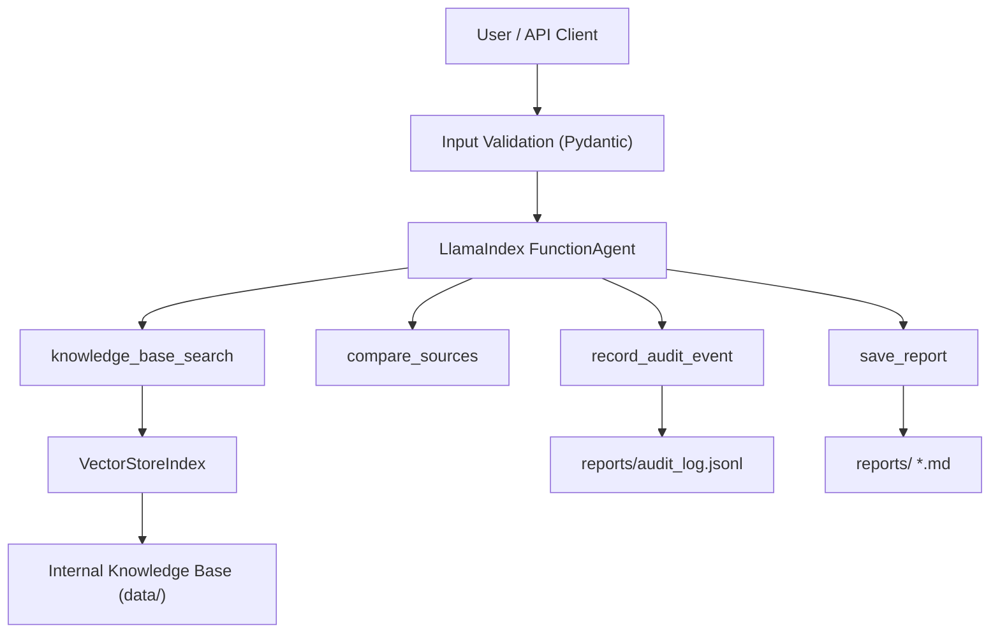

# EvidenceOps Agent: A Governed AI Research Assistant

In the rush to build autonomous AI agents, safety, grounding, and oversight often get left behind. **EvidenceOps Agent** is a lightweight, human-in-the-loop research assistant designed to bridge that gap.

Built with **LlamaIndex**, this agent doesn't just generate text. It retrieves evidence from a persistent vector knowledge base, utilizes controlled tools, maintains a strict audit trail, and **requires explicit human approval** before finalizing and saving any reports.

Whether you are interacting via the CLI or the FastAPI backend, EvidenceOps ensures that AI remains a powerful, yet fully governed, research tool.

---

## Key Features

- **Human-in-the-Loop (HITL):** A hard-coded approval gate prevents the agent from saving reports without explicit user consent.
- **Grounded Generation:** Leverages LlamaIndex to query a persistent `VectorStoreIndex`, ensuring claims are backed by your actual data.
- **Audit Trails:** Built-in tools record events and track the agent's decision-making process.
- **Flexible Interfaces:** Fully functional through a clean Command Line Interface (CLI) or as a RESTful backend using FastAPI.
- **Clean Dependency Management:** Utilizes `uv` for lightning-fast, isolated, and reproducible local environments.

---

## Tech Stack

**Python** | **LlamaIndex** | **FastAPI** | **uv**

---

## Quick Start

### 1. Set up the environment

```bash
uv sync
cp .env.example .env   # Add your API keys here
```

### 2. Ingest your knowledge base

Drop your source documents into the `data/` folder and build the vector index:

```bash
uv run python -m app.ingest
```

### 3. Interact with the Agent

**CLI Mode** — Ask a question, review the draft, and approve the final save:

```bash
uv run python -m app.cli
```

**FastAPI Backend** — Spin up the server:

```bash
uv run python -m app.api.main
```

Trigger a governed research run:

```bash
curl -X POST http://localhost:8000/research \
  -H "Content-Type: application/json" \
  -d '{"question": "Why should high-impact actions require approval?", "require_approval": true}'
```

---

## Testing & Evaluation

### Unit tests

```bash
uv run pytest
```

### LLM Evaluations

Run the evaluation suite and inspect the latest results:

```bash
uv run tests/evaluationResult.py
```

Results are saved to `tests/EvaluationResult003.json`. To run a new evaluation, update `tests/evaluation_dataset.jsonl` with your test cases, then run:

```bash
uv run pytest tests/evaluate.py
```

The output is automatically saved to `EvaluationResult003.json`.

---

## Architecture Diagram



---

## Project Structure

```
evidenceops-agent/
├── app/
│   ├── agents/           # Agent logic and LlamaIndex setup
│   ├── api/              # FastAPI endpoints
│   ├── services/         # LLM and VectorStore orchestration
│   ├── tools/            # Controlled toolset for the agent
│   └── cli.py            # Command Line Interface entry point
├── data/                 # Your raw source documents
├── reports/              # Agent-generated, human-approved output
└── storage/              # Persistent vector store index
```

---

## Ethical Considerations & Governance

This project is built with AI safety in mind:

- **Data as Data, Not Instructions:** Retrieved documents are strictly treated as contextual data to mitigate prompt-injection risks.
- **Governed Execution:** This system is explicitly designed for internal research use. It is not fully autonomous; all consequential actions (like writing to the filesystem) require human authorization.
